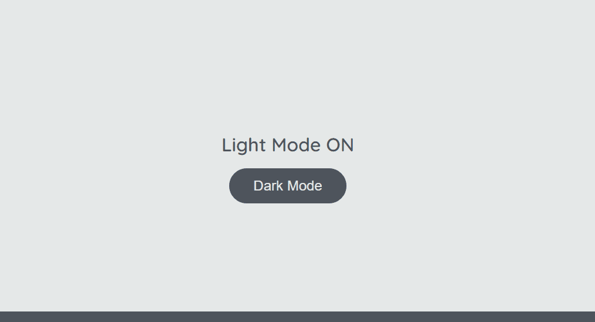

# Light Mode/Dark Mode

1. Estrutura básica de projeto front-end (HTML, CSS e JS)
2. Crie um arquivo chamado `scripts.js` na sua pasta `assets/js`
3. Selecione os elementos: `h1`, `button`, `footer` e `body`
4. Se os elementos possuirem a classe `dark-mode`, modifique seus estilos. Caso contrário, volte os estilos para o original
