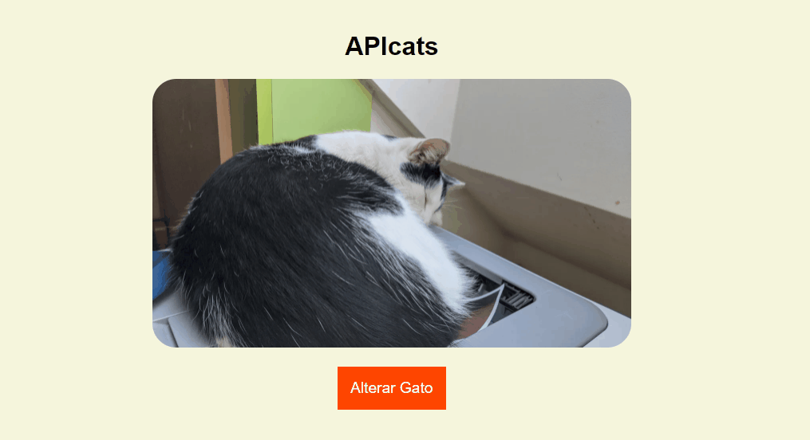

# APIcats

<h1 align ="center">
  
</h1>

 Foi criado uma página que ao clicarmos em um botão carrega fotos aleatórias de gatos.

A API <a href="https://thatcopy.pw/catapi/rest"> https://thatcopy.pw/catapi/rest</a> foi utilizada para fazer as chamadas com o método <b>fetch().</b>

